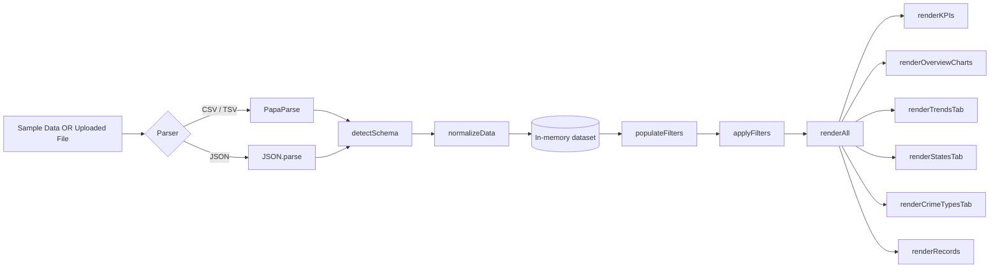

<div align="center">

# 🕵️‍♂️ CrimeScope

### Crime Data Analysis Dashboard — single‑file, zero‑backend, fully interactive

*Upload a dataset. Filter it. Explore it. All in the browser.*

[](#)
[](https://www.chartjs.org/)
[](https://www.papaparse.com/)
[](#)
[](#-license)


</div>

---

## 📖 Table of Contents

- [🕵️‍♂️ CrimeScope](#️️-crimescope)
    - [Crime Data Analysis Dashboard — single‑file, zero‑backend, fully interactive](#crime-data-analysis-dashboard--singlefile-zerobackend-fully-interactive)
  - [📖 Table of Contents](#-table-of-contents)
  - [🎯 What is CrimeScope?](#-what-is-crimescope)
  - [🖼 Live Preview](#-live-preview)
  - [✨ Features](#-features)
    - [📂 Data Ingestion](#-data-ingestion)
    - [🎛 Filtering](#-filtering)
    - [📊 Visualization](#-visualization)
    - [🔎 Records Explorer](#-records-explorer)
  - [🗂 Dashboard Tabs](#-dashboard-tabs)
  - [🚀 Getting Started](#-getting-started)
  - [📤 Bring Your Own Data](#-bring-your-own-data)
    - [Expected shape (flexible)](#expected-shape-flexible)
  - [⚙️ How It Works (Architecture)](#️-how-it-works-architecture)
  - [🧰 Tech Stack](#-tech-stack)
  - [📁 Project Structure](#-project-structure)
  - [🎨 Customization](#-customization)
  - [🌐 Browser Support](#-browser-support)
  - [🗺 Roadmap](#-roadmap)
  - [❓ FAQ](#-faq)
  - [🤝 Contributing](#-contributing)
  - [📄 License](#-license)

---

## 🎯 What is CrimeScope?

**CrimeScope** is a self-contained, single-file HTML dashboard for exploring tabular crime statistics — think state/district-level incident counts across years and crime categories (assault, kidnapping, dowry-related offences, and more).

There's no server, no build step, and no database. Open the `.html` file in a browser (or host it as a static page) and you get:

- A **pre-loaded sample dataset** (Indian crime-against-women statistics, 2005 onward) so the dashboard works instantly.
- The ability to **upload your own** `.csv`, `.json`, or `.tsv` file, with **automatic schema detection** — it figures out which columns are your region/date/category fields on its own.
- Rich, cross-filterable **charts, rankings, and a searchable data table**.

> 💡 Because the schema detection is generic, CrimeScope isn't hard-locked to one dataset — drop in *any* region + year + numeric-category dataset and it will adapt.

---

## 🖼 Live Preview

<div align="center">

| Overview | Trends | Region Rankings |
|:---:|:---:|:---:|
| KPIs · Trend line · Category share · Top regions | Multi-series year-over-year · YoY % change | Full state ranking · Drill-down district ranking |

*(Open `crime_dashboard.html` locally to see it live — no screenshots needed, it's all rendered client-side!)*

</div>

<details>
<summary>📽️ Click to see a quick tour of the UI</summary>

```
┌──────────────────────────────────────────────────────────────────┐
│  ⬛ CrimeScope        [Load Sample Dataset]  [Upload File]        │
├──────────────────────────────────────────────────────────────────┤
│  State/UT ▾   District ▾   Year From ▾   Year To ▾   [Reset]     │
├──────────────────────────────────────────────────────────────────┤
│  Overview │ Trends │ Region Rankings │ Crime Types │ Records      │
├──────────────────────────────────────────────────────────────────┤
│  [ KPI ] [ KPI ] [ KPI ] [ KPI ]                                  │
│  ┌────────────────────┐   ┌────────────────────┐                 │
│  │ Total Incidents     │   │ Crime Type Share    │                │
│  │ Over Time (line)    │   │ (doughnut/pie)       │                │
│  └────────────────────┘   └────────────────────┘                 │
│  ┌────────────────────────────────────────────┐                  │
│  │ Top 10 Regions by Total Reported Incidents  │                  │
│  └────────────────────────────────────────────┘                  │
└──────────────────────────────────────────────────────────────────┘
```

</details>

---

## ✨ Features

<table>
<tr>
<td width="50%" valign="top">

### 📂 Data Ingestion
- Load an **embedded sample dataset** with one click
- Upload **CSV, TSV, or JSON** files
- **Automatic schema detection** for region, sub-region, date/year, and numeric category columns
- Client-side parsing via **PapaParse** — nothing leaves the browser

### 🎛 Filtering
- Cascading **State/UT → District** dropdowns
- **Year range** filter (From / To)
- One-click **Reset Filters**
- Live **result-count badge**

</td>
<td width="50%" valign="top">

### 📊 Visualization
- Auto-updating **KPI cards** (totals, year range, top category, etc.)
- Line, bar, doughnut, and stacked charts via **Chart.js**
- **Year-over-year % change** chart
- Full & drill-down **region rankings**
- **Crime-type composition by year** (stacked view)

### 🔎 Records Explorer
- Full, **searchable** data table
- **Pagination** controls
- Reflects all active filters in real time

</td>
</tr>
</table>

---

## 🗂 Dashboard Tabs

<details open>
<summary><strong>1️⃣ Overview</strong></summary>

- KPI grid (total incidents, year range covered, top crime type, etc.)
- **Total Incidents Over Time** — line chart
- **Crime Type Share** — proportion of each offence category
- **Top 10 Regions by Total Reported Incidents** — horizontal bar chart

</details>

<details>
<summary><strong>2️⃣ Trends</strong></summary>

- **Year-over-Year Trend by Crime Type** — multi-series line chart
- **Total Incidents per Year** — bar chart
- **Year-over-Year % Change** — highlights acceleration/deceleration in reported incidents

</details>

<details>
<summary><strong>3️⃣ Region Rankings</strong></summary>

- **All Regions Ranked by Total Incidents** — full sortable ranking
- **Top 15 Sub-Regions (Selected Filters)** — drills into districts within the chosen state(s)

</details>

<details>
<summary><strong>4️⃣ Crime Types</strong></summary>

- **Crime Type Totals** for the currently selected filters
- **Crime Type Composition by Year** — stacked bar/area chart showing how the mix has shifted over time

</details>

<details>
<summary><strong>5️⃣ Records</strong></summary>

- Raw, filtered data in a **searchable, paginated table**
- Live record-count badge
- Great for spot-checking or exporting insights manually

</details>

---

## 🚀 Getting Started

No installation, no dependencies to manage, no `npm install`.

```bash
# 1. Clone or download this repository
git clone https://github.com/<your-username>/crimescope.git
cd crimescope

# 2. Just open it!
open crime_dashboard.html      # macOS
start crime_dashboard.html     # Windows
xdg-open crime_dashboard.html  # Linux
```

Or, to serve it (recommended if you plan on uploading local files via `fetch`-restricted browsers):

```bash
# Any static server works — for example:
npx serve .
# then open the printed localhost URL
```

You can also drag-and-drop the HTML file straight into any modern browser tab.

---

## 📤 Bring Your Own Data

Click **Upload File** and pick a `.csv`, `.tsv`, or `.json` file. CrimeScope will:

1. Parse it (via **PapaParse** for CSV/TSV, native `JSON.parse` for JSON).
2. **Auto-detect the schema**:
   - A primary region column (e.g. `state`, `state/ut`, `country`) → **Dimension 1**
   - A secondary region column (e.g. `district`, `city`) → **Dimension 2**
   - A date or year column → parsed into a numeric `year`
   - Remaining numeric columns → treated as **crime-type / category fields**
3. Rebuild every filter, KPI, and chart against the new dataset — no page reload needed.

### Expected shape (flexible)

| state          | district | year | rape | kidnap | dowry | assault | insult | cruelty | importation |
|----------------|----------|------|------|--------|-------|---------|--------|---------|-------------|
| andhra pradesh | adilabad | 2005 | 46   | 60     | 21    | 154     | 33     | 129     | 0           |
| bihar          | patna    | 2006 | 54   | 84     | 54    | 13      | 2      | 239     | 0           |
| ...            | ...      | ...  | ...  | ...    | ...   | ...     | ...    | ...     | ...         |

> Column **names don't have to match exactly** — CrimeScope's schema detector looks for common naming patterns (region-like, date/year-like, numeric) and adapts the filter labels (e.g. `dimLabel1` / `dimLabel2`) to match your headers.

---

## ⚙️ How It Works (Architecture)



Everything — parsing, filtering, aggregation, and chart rendering — happens **synchronously in the browser**, driven by a small set of pure JS functions:

| Function | Responsibility |
|---|---|
| `detectSchema(rows)` | Infers which columns are region/date/numeric fields |
| `normalizeData(rows, schema)` | Cleans and reshapes raw rows into a consistent internal format |
| `populateFilters()` / `populateDim2()` | Fills the State/UT and District dropdowns |
| `applyFilters()` | Produces the currently `filtered` dataset from all active controls |
| `groupByYear` / `groupByState` / `groupByDistrict` | Aggregation helpers for charts and rankings |
| `renderKPIs()` | Computes and paints the KPI cards |
| `renderOverviewCharts()` / `renderTrendsTab()` / `renderStatesTab()` / `renderCrimeTypesTab()` / `renderRecords()` | Populate each tab's charts/table |
| `renderAll()` | Orchestrates a full re-render whenever filters or data change |

---

## 🧰 Tech Stack

| Layer | Choice | Why |
|---|---|---|
| Markup / Styling | Plain **HTML5 + CSS3** (custom properties, no framework) | Zero build step, fully portable |
| Charts | [**Chart.js 4**](https://www.chartjs.org/) (via CDN) | Lightweight, responsive canvas-based charts |
| CSV/TSV parsing | [**PapaParse 5**](https://www.papaparse.com/) (via CDN) | Fast, robust, handles messy real-world CSVs |
| JSON parsing | Native `JSON.parse` | No dependency needed |
| State management | Vanilla JS module-level variables (`charts`, `filtered`, schema objects) | Simple enough not to need a framework |

**No React. No Vue. No bundler. No backend. Just one HTML file.**

---

## 📁 Project Structure

```
crimescope/
├── crime_dashboard.html   # The entire application (markup + styles + logic)
└── README.md              # You are here
```

Everything — the dark neon UI theme, the embedded sample dataset, the parsing logic, and the Chart.js configurations — lives inside the single HTML file for maximum portability.

---

## 🎨 Customization

<details>
<summary><strong>Change the color theme</strong></summary>

All colors are defined as CSS custom properties near the top of the `<style>` block:

```css
:root{
  --bg:#07050c; --bg2:#0d0818; --panel:#100b1e;
  --purple:#a742ff; --purple2:#7c2ae8;
  --neon-green:#39ff9d; --neon-pink:#ff3df0;
  --text:#e7e0ff; --dim:#8f7fb8; --border:#2a1f47;
}
```

Tweak these to re-skin the entire dashboard in seconds.

</details>

<details>
<summary><strong>Swap in your own default dataset</strong></summary>

Replace the embedded sample-data array in the `<script>` block, or simply click **Upload File** at runtime — no code changes required for ad-hoc datasets.

</details>

<details>
<summary><strong>Add a new tab or chart</strong></summary>

1. Add a `<button class="tab-btn" data-tab="yourtab">` to `#tabBar`.
2. Add a matching `<div class="content" id="tab-yourtab">` with a `<canvas>` inside a `.panel`.
3. Write a `renderYourTab()` function following the pattern of the existing `render*` functions, and call it from `renderAll()`.

</details>

---

## 🌐 Browser Support

Works in any modern evergreen browser with ES6+ and `<canvas>` support:

| Chrome | Edge | Firefox | Safari |
|:---:|:---:|:---:|:---:|
| ✅ | ✅ | ✅ | ✅ |

No Internet Explorer support (Chart.js 4 and modern JS syntax are used).

---

## 🗺 Roadmap

- [ ] Export filtered results to CSV
- [ ] Persist last-used dataset/filters in `localStorage`
- [ ] Map-based regional visualization
- [ ] Dark/Light theme toggle
- [ ] Configurable color palette per crime category

Have an idea? Open an issue or submit a PR — see [Contributing](#-contributing).

---

## ❓ FAQ

<details>
<summary><strong>Does my data get uploaded anywhere?</strong></summary>

No. All parsing and rendering happens entirely client-side in your browser. Nothing is sent to a server.

</details>

<details>
<summary><strong>Can I use this for non-crime datasets?</strong></summary>

Yes — as long as your data has a region-like column, a date/year-like column, and one or more numeric category columns, the schema detector should pick it up. Think of it as a generic "region × year × category" explorer.

</details>

<details>
<summary><strong>Why is there no backend?</strong></summary>

Simplicity and portability. You can host this on GitHub Pages, drop it in a shared drive, or just double-click the file — it works the same everywhere.

</details>

---

## 🤝 Contributing

Contributions are welcome!

1. Fork the repo
2. Create a feature branch: `git checkout -b feature/my-idea`
3. Commit your changes: `git commit -m "Add my idea"`
4. Push to the branch: `git push origin feature/my-idea`
5. Open a Pull Request

Please keep the project dependency-free (CDN-only) and single-file where possible — that portability is the whole point of CrimeScope.

<<<<<<< HEAD
By contributing, you agree your contributions will be licensed under the project's Boost Software License 1.0.

---

## 📄 License

Released under the **Boost Software License 1.0 (BSL-1.0)** — permissive, no attribution required in binary/compiled redistributions, minimal restrictions.

[](https://www.boost.org/LICENSE_1_0.txt)

```
Boost Software License - Version 1.0 - August 17th, 2003

Permission is hereby granted, free of charge, to any person or organization
obtaining a copy of the software and accompanying documentation covered by
this license (the "Software") to use, reproduce, display, distribute,
execute, and transmit the Software, and to prepare derivative works of the
Software, and to permit third-parties to whom the Software is furnished to
do so, all subject to the following:

The copyright notices in the Software and this entire statement, including
the above license grant, this restriction and the following disclaimer,
must be included in all copies of the Software, in whole or in part, and
all derivative works of the Software, unless such copies or derivative
works are solely in the form of machine-executable object code generated by
a source language processor.

THE SOFTWARE IS PROVIDED "AS IS", WITHOUT WARRANTY OF ANY KIND, EXPRESS OR
IMPLIED, INCLUDING BUT NOT LIMITED TO THE WARRANTIES OF MERCHANTABILITY,
FITNESS FOR A PARTICULAR PURPOSE, TITLE AND NON-INFRINGEMENT. IN NO EVENT
SHALL THE COPYRIGHT HOLDERS OR ANYONE DISTRIBUTING THE SOFTWARE BE LIABLE
FOR ANY DAMAGES OR OTHER LIABILITY, WHETHER IN CONTRACT, TORT OR OTHERWISE,
ARISING FROM, OUT OF OR IN CONNECTION WITH THE SOFTWARE OR THE USE OR OTHER
DEALINGS IN THE SOFTWARE.
```

---

=======
>>>>>>> b549f598e1981215c46a48aec1bebbb69bec29e1
<div align="center">

Made with 💜 and a lot of `<canvas>` elements.

**⭐ If CrimeScope helped you explore your data, consider starring the repo!**

</div>
